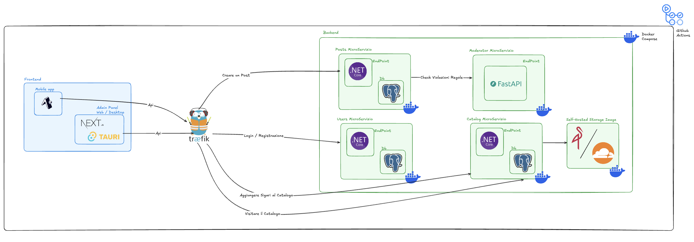

# 🚬 CigarClubApp

Un'applicazione completa per la gestione di un club di sigari, con catalogazione, social features e sistema di moderazione automatica.



## 📋 Panoramica

CigarClubApp è una piattaforma moderna per appassionati di sigari che combina funzionalità social con un catalogo dettagliato di sigari. L'applicazione permette agli utenti di esplorare il catalogo, condividere post, interagire con la community e agli amministratori di gestire contenuti e moderare le discussioni.

## 🏗️ Architettura

L'applicazione segue un'architettura a **microservizi** per garantire scalabilità, manutenibilità e separazione delle responsabilità:

### Frontend
- **Mobile App**: Applicazione React Native con Expo Router
  - UI dark theme con accenti dorati
  - Navigazione fluida e intuitiva
  
- **Admin Panel**: Dashboard web/desktop con Next.js e Tauri
  - Gestione utenti e contenuti
  - Monitoraggio attività
  - Controllo moderazione

### Backend
L'infrastruttura backend è containerizzata con Docker Compose e include quattro microservizi indipendenti:

#### 1. **Posts MicroServizio** (.NET Core)
- Gestione dei post della community
- CRUD operations per contenuti
- Sistema di interazioni (like, commenti)
- Database PostgreSQL dedicato

#### 2. **Users MicroServizio** (.NET Core)
- Autenticazione e registrazione utenti
- Gestione profili e preferenze
- Sistema di ruoli e permessi
- Database PostgreSQL dedicato

#### 3. **Catalog MicroServizio** (.NET Core)
- Catalogo completo dei sigari
- Ricerca e filtri avanzati
- Dettagli prodotti (origine, vitola, wrapper, etc.)
- Gestione immagini e recensioni
- **Storage immagini**: MinIO (dockerizzato per sviluppo, Cloudflare in produzione)
- Database PostgreSQL dedicato

#### 4. **Moderator MicroServizio** (FastAPI)
- AI-powered content moderation (beta)
- Controllo automatico violazioni regole
- Sistema di flagging e alerting
- Integrazione con microservizio Posts

## 🛠️ Stack Tecnologico

### Mobile App
- **Framework**: React Native + Expo
- **Routing**: Expo Router (file-based)
- **Language**: TypeScript
- **State Management**: Context API / React Query
- **Styling**: Custom dark theme con accenti oro

### Admin Panel
- **Framework**: Next.js 14
- **Desktop**: Tauri
- **Language**: TypeScript
- **UI**: TailwindCSS + Shadcn UI

### Backend
- **.NET Core**: Microservizi Posts, Users, Catalog
  - ASP.NET Core Web API
  - Entity Framework Core
  - JWT Authentication
  - FluentValidation
  
- **FastAPI**: Microservizio Moderator
  - Python 3.11+
  - Machine Learning models per moderazione
  - Async/await operations

### Database & Storage
- **PostgreSQL**: Database relazionale per ogni microservizio
- Isolamento dei dati per servizio
- Migrazioni con Entity Framework Core

#### Storage Immagini
- **MinIO** (Development): Object storage S3-compatible dockerizzato
  - Self-hosted per ambiente di sviluppo
  - Gestione bucket per immagini sigari
  - API compatibili con S3
- **Cloudflare** (Production): 
  - Cloudflare R2 o Cloudflare Images per storage in produzione
  - CDN globale per performance ottimali
  - Costi ridotti e alta disponibilità

### Infrastructure
- **Docker**: Containerizzazione servizi
- **Docker Compose**: Orchestrazione multi-container
- **Traefik** : Reverse proxy e load balancing

## 🚀 Funzionalità Principali

### Per gli Utenti
- ✅ Registrazione e login sicuro
- 📱 Esplorazione catalogo sigari con filtri avanzati
- 🔍 Ricerca per marca, origine, vitola
- 📝 Visualizzazione dettagli completi (wrapper, binder, filler, etc.)
- 💬 Creazione e condivisione post
- ⭐ Sistema di valutazioni e recensioni

### Per gli Amministratori
- 👥 Gestione utenti e ruoli
- ➕ Aggiunta e modifica sigari al catalogo
- 📊 Dashboard analytics
- 🛡️ Monitoraggio moderazione automatica
- 🚫 Gestione contenuti flaggati

### Sistema di Moderazione
- 🤖 Controllo automatico violazioni regole
- 🚨 Flagging contenuti inappropriati
- 📋 Queue di revisione manuale
- 📈 Report e statistiche

## 📦 Installazione e Setup

### Prerequisiti
- Node.js 18+
- .NET 8.0 SDK
- Python 3.11+
- Docker & Docker Compose
- PostgreSQL 15+ (o via Docker)
- Expo CLI

### 1. Clone Repository
```bash
git clone https://github.com/Marco-Pagnanini/CigarClubApp.git
cd CigarClubApp
```

### 2. Setup Mobile App
```bash
cd frontend/mobile
npm install
npx expo start
```

### 3. Setup Admin Panel
```bash
cd frontend/admin-panel
npm install
npm run dev / npx tauri dev
```

### 4. Setup Backend con Docker Compose
```bash
cd backend
docker-compose up -d
```

Questo comando avvierà tutti i microservizi e i relativi database PostgreSQL.

### 5. Setup Manuale Microservizi (Development)

#### Posts MicroServizio
```bash
cd backend/PostsService
dotnet restore
dotnet ef database update
dotnet run
```

#### Users MicroServizio
```bash
cd backend/UsersService
dotnet restore
dotnet ef database update
dotnet run
```

#### Catalog MicroServizio
```bash
cd backend/CatalogService
dotnet restore
dotnet ef database update
dotnet run
```

#### Moderator MicroServizio
```bash
cd backend/ModeratorService
pip install -r requirements.txt
uvicorn main:app --reload
```

## 📱 Struttura Mobile App

```
mobile-app/
├── app/
│   ├── (tabs)/
│   │   ├── index.tsx           # Home/Feed
│   │   ├── catalog.tsx         # Catalogo sigari
│   │   ├── profile.tsx         # Profilo utente
│   ├── index.tsx
│   ├── register.tsx
|   ├── add-post.tsx
|   ├── cigar-detail.tsx
|   ├── scan.tsx
│   ├── post/
│   │   └── [id].tsx            # Dettaglio Post
│   └── _layout.tsx
├── components/
│   ├── CigarCard.tsx
│   ├── PostCard.tsx
│   └── CustomTabBar.tsx
├── services/
│   ├── api.ts
│   └── auth.ts
└── constants/
    └── Colors.ts               # Dark theme + oro
```

## 🎨 Design System

- **Colori Primari**: Nero (#000000), Grigio scuro (#1A1A1A)
- **Accenti**: Oro (#D4AF37), Oro chiaro (#F5E6C8)
- **Testo**: Bianco (#FFFFFF), Grigio chiaro (#CCCCCC)
- **Tipografia**: System default, pesi 400-700

## 🔐 Sicurezza

- JWT-based authentication
- Role-based access control (RBAC)
- Password hashing con bcrypt
- HTTPS enforcement in produzione
- Rate limiting su API endpoints
- CORS policy configurabile
## 📝 License

Questo progetto è sotto licenza MIT - vedi il file [LICENSE](LICENSE) per dettagli.

## 👨‍💻 Autore

**Marco** - [GitHub Profile](https://github.com/Marco-Pagnanini)

## 🙏 Ringraziamenti

- Community di appassionati di sigari
- Contributors open source
- Framework e librerie utilizzate

---

⭐ Se questo progetto ti è utile, lascia una stella su GitHub!
